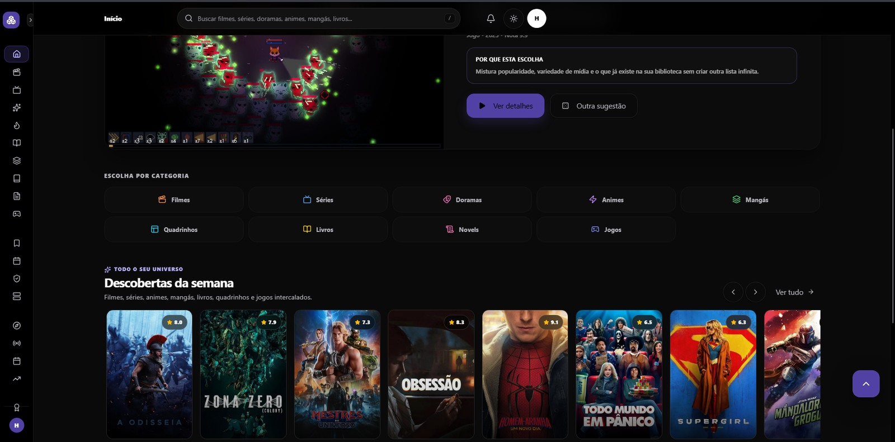
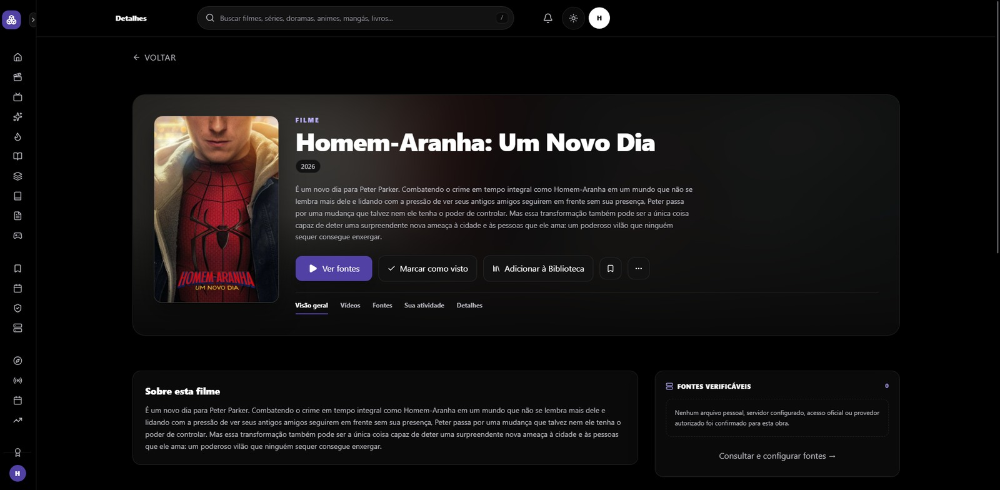
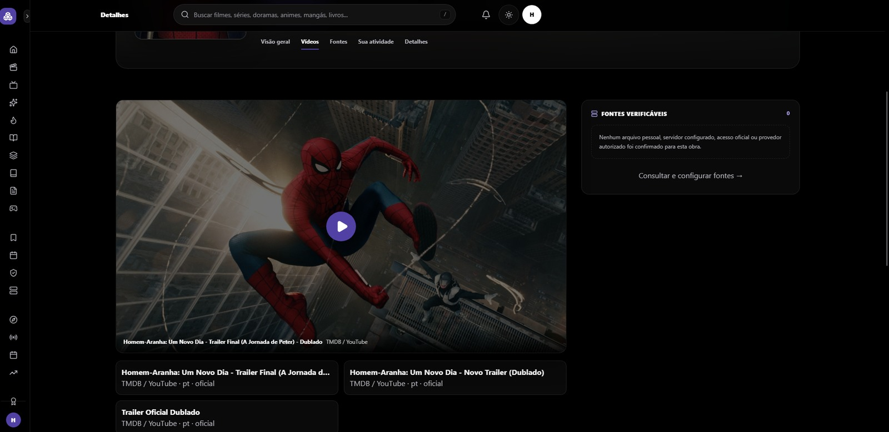
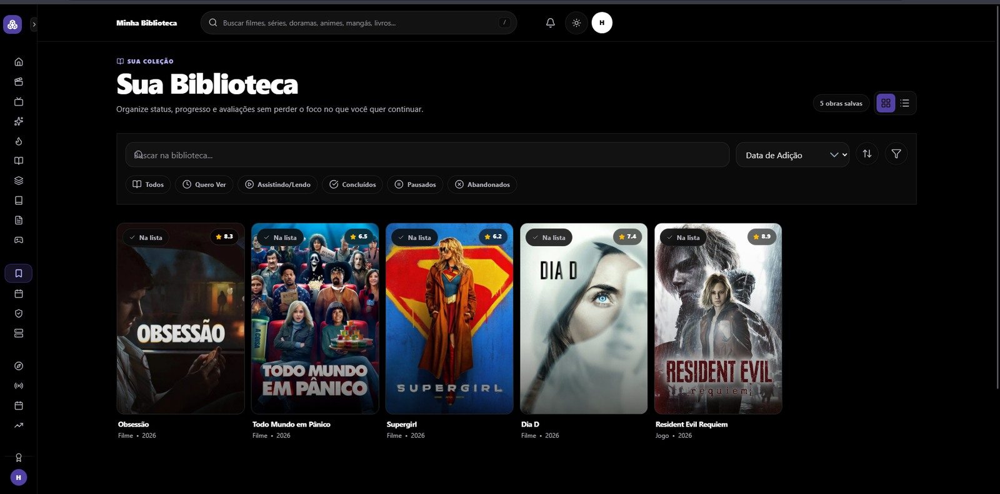
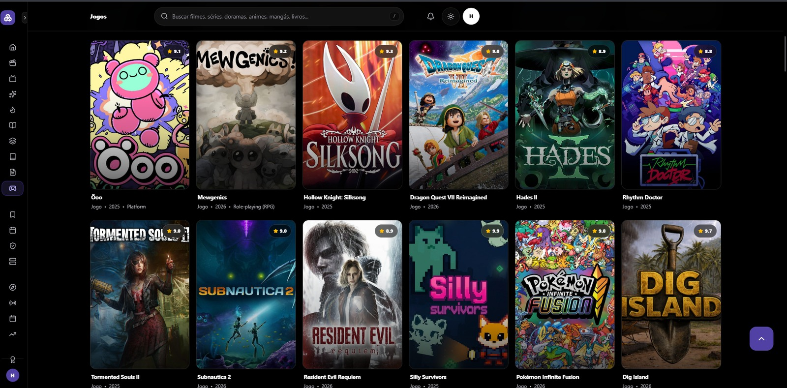
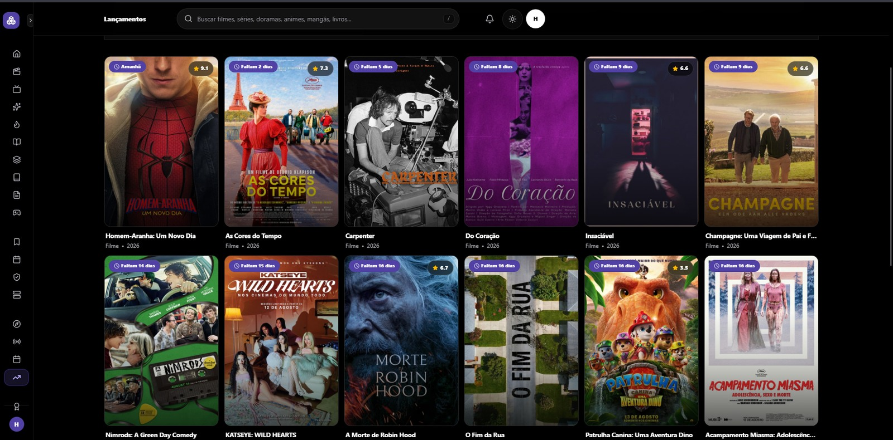
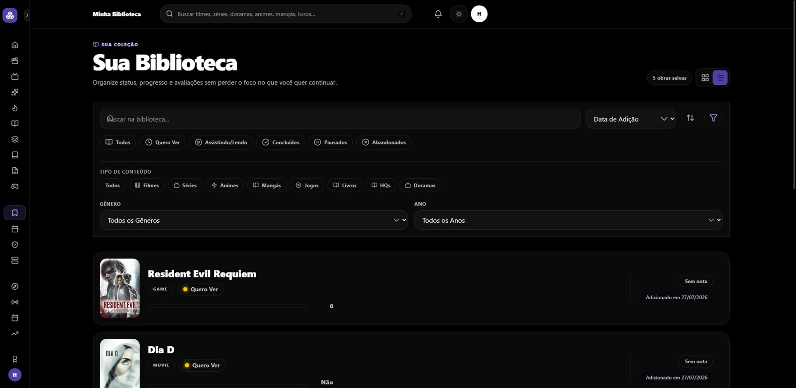
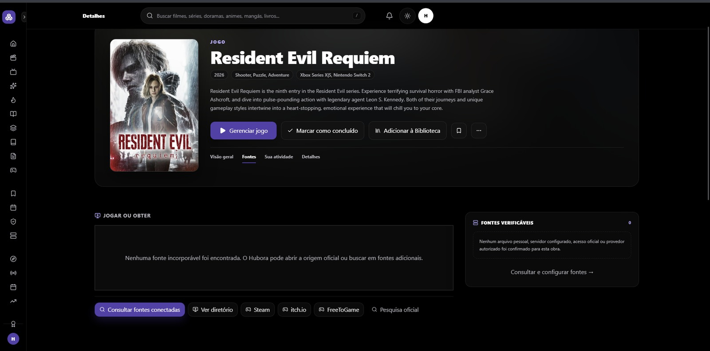
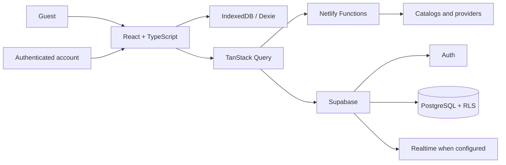

<div align="center">

# Hubora

### One personal hub to discover, organize and track a pop-culture universe.

[Português](README.md) · [Tests](TEST_EVIDENCE.md) · [Providers](PROVIDER_MATRIX.md)

[](https://hubora.netlify.app/)
[](https://github.com/Mayconxzdev/Hubora)
[](https://github.com/Mayconxzdev/Hubora/actions/workflows/ci.yml)


**Public demo:** [hubora.netlify.app](https://hubora.netlify.app/)

</div>



## Overview

I created **Hubora** to bring movies, TV shows, Korean dramas, anime, manga, comics, books, novels and games into one place. The idea came from having personal history, progress and watch/read/play lists spread across multiple services.

The application lets people discover an item, inspect metadata and sources, save it to a library and track progress. It was also my final project for the 40-hour **AI Tools: Agents and Automations** course at SENAI Casa Firjan.

| Area | Current state |
|---|---|
| **Type** | Responsive web application and installable PWA |
| **My work** | Product, UX/UI, architecture, development, integrations, persistence, authentication and documentation |
| **No-account use** | Guest mode with data stored on the device |
| **Authenticated use** | Supabase when the remote environment is configured |
| **External content** | Metadata, availability and playback are shown with explicit limits; no player or source is fabricated |
| **Version** | v1.0.0 published as a demo; external integrations and multi-user validation are tracked separately |

## Current quality checks

The `main` branch passes zero-warning linting, type checking, 138 unit tests, production/PWA build, desktop E2E regression and visual/accessibility checks on desktop, tablet and Android.

Commands and reports are available in [TEST_EVIDENCE.md](TEST_EVIDENCE.md) and [RELEASE_READINESS_REPORT.md](RELEASE_READINESS_REPORT.md).

## Try the application

1. Open the [public demo](https://hubora.netlify.app/) without creating an account.
2. Browse the nine categories and use global search.
3. Open an item to inspect metadata, official videos and available sources.
4. Add items to the library and change their status or progress.
5. Try filtering, sorting and grid/list views.

**Shortcuts:** [Home](https://hubora.netlify.app/) · [Movies](https://hubora.netlify.app/movies) · [Games](https://hubora.netlify.app/games) · [Releases](https://hubora.netlify.app/releases) · [Library](https://hubora.netlify.app/library)

## Main flows

### Understand an item before deciding

The details page adapts metadata and actions to each media domain. People can inspect sources, mark an item complete, add it to a library and browse videos and supporting information.



### Show only verifiable content

Trailers and videos appear only when the source allows embedding. Without a confirmed authorized source, the interface explains the limitation instead of simulating availability.



### Keep a cross-media library

The library brings different media types together with search, sorting, filters and grid/list views.



### Preserve domain differences

| Games | Releases |
|---|---|
| The catalog keeps the product language while using data and actions specific to games. | The application organizes upcoming releases and time-based discovery. |
|  |  |

<details>
<summary><strong>See more screens</strong></summary>

### Library list view and advanced filters



### Game sources



</details>

> Screenshots were captured from the running application. Artwork, titles, trailers, metadata and trademarks belong to their respective sources.

## What I built

- one catalog across **nine media domains**;
- global search, category discovery and domain-aware detail pages;
- personal library with status, ratings, progress, filters and lists;
- diary, goals, releases, Wrapped, connections and insights;
- device-local persistence and PWA support;
- email/password and Google authentication when enabled in Supabase;
- import, export and local backup;
- serverless functions for integrations whose credentials cannot be sent to the browser;
- explicit loading, empty, error and provider-unavailable states.

## Product and engineering decisions

| Challenge | Decision | Result |
|---|---|---|
| Unify media with different structures | Shared canonical identity plus domain-specific fields | Consistent UX without treating books, games, movies and shows as the same object |
| Let people use it without registration | Local-first architecture with IndexedDB/Dexie | Lower onboarding friction and useful device-local data |
| Separate personal records by account | Supabase Auth, PostgreSQL and RLS policies | Foundation for account isolation; a fresh independent remote verification is still required before a full-production claim |
| Protect credentials | Netlify Functions outside the browser bundle | Clearer client/server boundary |
| Keep large catalogs responsive | Persistent cache, progressive loading, virtualization and on-demand images | Less unnecessary browser work |
| Treat commercial sources responsibly | Separate metadata, previews, embeddable content and external links | The interface shows only what each source actually allows |

## Architecture



## Stack

| Area | Technologies |
|---|---|
| UI | React 19, TypeScript, Vite, Tailwind CSS, Radix UI, Motion |
| State and async data | Zustand, TanStack Query |
| Local persistence | IndexedDB, Dexie, idb-keyval |
| Serverless backend | Netlify Functions, Express |
| Authentication and cloud | Supabase Auth, PostgreSQL, Realtime and Row Level Security |
| Validation | Zod, ESLint, TypeScript |
| Testing and accessibility | Vitest, Testing Library, Playwright, axe-core |
| Delivery | PWA, Netlify and release-verification scripts |

## Run locally

```bash
npm run verify:static
npm run check
npm run verify:release
```

**Requirements:** Node.js `>= 22.12.0` and npm compatible with the committed `package-lock.json`.

```bash
git clone https://github.com/Mayconxzdev/Hubora.git
cd Hubora
npm ci --no-audit --no-fund
cp .env.example .env
npm run dev
```

## Documentation

- [Product contract](PRODUCT.md)
- [Design direction](DESIGN.md)
- [Provider matrix](PROVIDER_MATRIX.md)
- [Environment variables](ENVIRONMENT_VARIABLES.md)
- [Tests](TEST_EVIDENCE.md)
- [Release status](RELEASE_READINESS_REPORT.md)
- [Deploy and rollback](DEPLOY_AND_ROLLBACK.md)
- [Security policy](SECURITY.md)

## Current limits

- providers depend on valid credentials, API availability, region and embedding permissions;
- commercial sources do not receive an internal player without confirmed authorization;
- Jellyfin, Plex, Emby, Komga, Kavita and OPDS connections require owner configuration;
- authentication, synchronization and Realtime require a correctly configured Supabase environment;
- the public demo shows the last successful production deployment; the `main` branch is the most current reference while Netlify account quota prevents a new deployment;
- Google Books remains unavailable because of an external provider failure and is shown with an explicit unavailable state.

## Author

**Maycon Ferreira**

[GitHub](https://github.com/Mayconxzdev) · [Public demo](https://hubora.netlify.app/)

## License

Code is distributed under [GNU AGPL-3.0-or-later](LICENSE). Artwork, covers, metadata and external services remain subject to their respective rights, licenses and terms.
