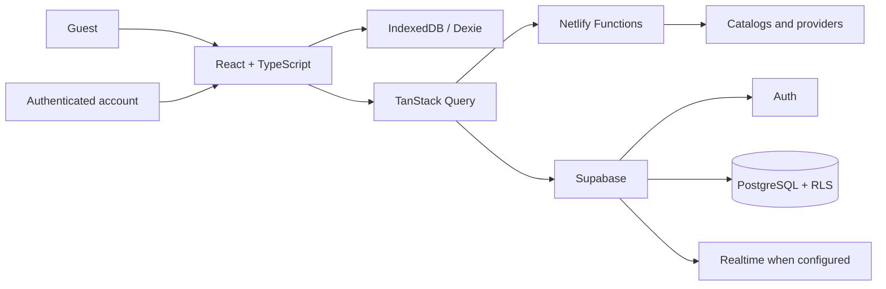

<div align="center">

# Hubora

### One personal hub to discover, organize, and track a pop-culture universe.

[Português](README.md) · [Technical evidence](TEST_EVIDENCE.md) · [Provider matrix](PROVIDER_MATRIX.md)

[](https://hubora.netlify.app/)
[](https://github.com/Mayconxzdev/Hubora)
[](https://github.com/Mayconxzdev/Hubora/actions/workflows/ci.yml)


**Public demo:** [hubora.netlify.app](https://hubora.netlify.app/)

</div>


## Overview

**Hubora** is a responsive, full-stack, local-first web application for discovering, organizing, and tracking **movies, TV shows, Korean dramas, anime, manga, comics, books, novels, and games**.

It addresses a real problem: personal history, progress, and watch/read/play lists are spread across disconnected services. Hubora provides one continuous journey — find an item, understand metadata and sources, save it to a personal library, and keep track of progress without losing context.

| | |
|---|---|
| **Type** | Responsive web application and installable PWA |
| **Contribution** | Product conception, UX/UI, architecture, development, integrations, persistence, authentication, and documentation |
| **Academic context** | Final project for the **AI Tools: Agents and Automations** course (40 hours), completed at **SENAI Casa Firjan** |
| **Usage modes** | Guest mode with local data; authenticated account when the remote environment is configured |
| **Content principle** | Metadata, availability, and playback are shown with explicit limits; no player or source is fabricated |
| **Version status** | **v1.0.0** published as a portfolio demonstration; external integrations and multi-user validation are tracked separately |

## Quick quality evidence

The current [`main`](https://github.com/Mayconxzdev/Hubora/tree/main) passed [CI](https://github.com/Mayconxzdev/Hubora/actions): **zero-warning linting, type checking, 138 unit tests, production/PWA build, desktop E2E regression, and visual/accessibility audits on desktop, tablet, and Android**.

Reproducible commands and reports are available in [TEST_EVIDENCE.md](TEST_EVIDENCE.md) and [RELEASE_READINESS_REPORT.md](RELEASE_READINESS_REPORT.md).

## Two-minute evaluation

1. Open the [public demo](https://hubora.netlify.app/) without creating an account.
2. Browse the nine categories and use global search.
3. Open an item and inspect metadata, official videos, and verifiable sources.
4. Add it to the library and change its status or progress.
5. Try filtering, sorting, and grid/list views.

**Shortcuts:** [Home](https://hubora.netlify.app/) · [Movies](https://hubora.netlify.app/movies) · [Games](https://hubora.netlify.app/games) · [Releases](https://hubora.netlify.app/releases) · [Library](https://hubora.netlify.app/library)

## Product walkthrough

### 1. Understand an item before deciding

The details page adapts metadata and actions to each domain. People can inspect sources, mark an item complete, add it to a library, and browse videos, activity, and supplementary information.


### 2. Surface only verifiable content

Official trailers and videos are shown only when the source permits embedding. Without a confirmed authorized source, the interface explains the limitation rather than simulating availability.


### 3. Build a cross-media personal library

The library brings different media types together with search, sorting, filtering, and grid/list views.


### 4. Keep domain differences without losing consistency

<table>
<tr>
<td width="50%" valign="top">

**Games as a first-class domain**

The games catalog maintains the product language while offering domain-specific data and actions.


</td>
<td width="50%" valign="top">

**Release tracking**

The product organizes upcoming releases and time-based discovery, going beyond a static catalog.


</td>
</tr>
</table>

<details>
<summary><strong>See more interface evidence</strong></summary>

### Library list view and advanced filters


### Game sources


</details>

> Screenshots were captured from the running application. Artwork, titles, trailers, metadata, and trademarks belong to their respective sources and are shown exclusively to demonstrate the product experience.

## Main deliverables

- one catalog across **nine media domains**;
- global search, category discovery, and domain-aware detail pages;
- personal library with status, ratings, progress, filters, and lists;
- diary, goals, releases, Wrapped, connections, and insights;
- device-local persistence and PWA support;
- email/password and Google authentication when enabled in Supabase;
- import, export, and local backup;
- serverless functions for integrations whose credentials cannot be sent to the browser;
- honest loading, empty, error, and provider-unavailable states.

## Product and engineering decisions

| Challenge | Decision | Value |
|---|---|---|
| Unify media with different structures | Shared canonical identity plus domain-specific fields and actions | Consistent UX without treating books, games, movies, and shows as one object |
| Let people try the product without registration | **Local-first** architecture with IndexedDB/Dexie | Lower onboarding friction and useful device-local data |
| Separate personal records by account | Versioned Supabase Auth, PostgreSQL, and RLS-policy integration | Foundation for isolation; a fresh independent remote two-account verification remains documented as pending |
| Protect credentials and provider integrations | Secrets are processed in Netlify Functions, outside the browser bundle | Clear client/server boundary and reduced exposure |
| Keep large catalogs responsive | Persistent cache, progressive loading, virtualization, and on-demand images | Smoother navigation and less unnecessary browser work |
| Treat commercial sources responsibly | Explicit distinction among metadata, previews, embeddable content, and external links | Honest communication about what is actually available |

## Architecture



## Technical stack

| Area | Technologies |
|---|---|
| **UI** | React 19, TypeScript, Vite, Tailwind CSS, Radix UI, Motion |
| **State and async data** | Zustand, TanStack Query |
| **Local persistence** | IndexedDB, Dexie, idb-keyval |
| **Serverless backend** | Netlify Functions, Express |
| **Authentication and cloud** | Supabase Auth, PostgreSQL, Realtime, and Row Level Security policies |
| **Validation** | Zod, ESLint, TypeScript |
| **Testing and accessibility** | Vitest, Testing Library, Playwright, axe-core |
| **Delivery** | PWA, Netlify, and release-verification scripts |

## Skills demonstrated

- React and TypeScript application architecture;
- multi-domain product and data modeling;
- client state, async caching, and offline persistence;
- API integration and Functions without exposing secrets;
- responsive, accessible, state-driven UI;
- unit, end-to-end, regression, and accessibility testing;
- technical documentation for providers, variables, deployment, rollback, and product limits.

## Quality and local execution

```bash
# static security and release contracts
npm run verify:static

# lint, types, unit tests, and production build
npm run check

# full verification including E2E tests
npm run verify:release
```

**Requirements:** Node.js `>= 22.12.0` and npm compatible with the committed `package-lock.json`.

```bash
git clone https://github.com/Mayconxzdev/Hubora.git
cd Hubora
npm ci --no-audit --no-fund
cp .env.example .env
npm run dev
```

## Documentation and evidence

- [Product contract](PRODUCT.md)
- [Design direction](DESIGN.md)
- [Provider matrix](PROVIDER_MATRIX.md)
- [Environment variables](ENVIRONMENT_VARIABLES.md)
- [Test evidence](TEST_EVIDENCE.md)
- [Release readiness](RELEASE_READINESS_REPORT.md)
- [Deploy and rollback](DEPLOY_AND_ROLLBACK.md)
- [Security policy](SECURITY.md)

## Current status and limitations

**Hubora v1.0.0** is published as a portfolio demonstration and runs locally with the checks above. It does not present external dependencies as guaranteed features:

- providers depend on valid credentials, API availability, region, and embedding permissions;
- commercial sources never receive an internal player without proven authorization;
- personal-server integrations (Jellyfin, Plex, Emby, Komga, Kavita, and OPDS) require owner configuration;
- authentication, synchronization, and Realtime require a correctly configured Supabase environment; fresh two-account remote-isolation evidence must be renewed before a full-production claim;
- The public Netlify URL shows the last successful production deployment; publishing the current `main` awaits Netlify account quota recovery. Until then, the source code, [CI](https://github.com/Mayconxzdev/Hubora/actions), and repository documentation are the current-review reference.

## Developer

**Maycon Ferreira**

Built to demonstrate digital product work, web engineering, automation, API integration, local persistence, authentication, security, and software quality.

[GitHub](https://github.com/Mayconxzdev) · [Public demo](https://hubora.netlify.app/)

## License

Code is distributed under [GNU AGPL-3.0-or-later](LICENSE). Artwork, covers, metadata, and external services remain subject to their respective rights, licenses, and terms.
