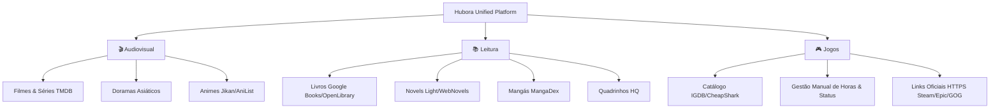

# 🌌 Hubora v9.0.0 — Unified Pop Culture Hub & Media Tracker

<div align="center">

[](https://vitejs.dev/)
[](https://react.dev/)
[](https://www.typescriptlang.org/)
[](https://tailwindcss.com/)
[](https://www.netlify.com/)
[](https://supabase.com/)
[](https://vitest.dev/)

</div>

---

### 📌 Sobre o Projeto

**Hubora** é uma plataforma web de alta performance projetada para centralizar e organizar a experiência de entretenimento de cultura pop. O sistema unifica **9 domínios universais de mídias** em uma única interface cinematográfica, responsiva e focada em privacidade.

---

## 🎨 Apresentação das Mídias Universais



---

## 💎 Arquitetura & Destaques de Engenharia (Senior Level)

### 🔒 1. Zero-Token Security & Proxy Serverless (Netlify Edge Functions)
- Nenhuma chave de API de terceiros (TMDB, IGDB, Supabase) é exposta no cliente público.
- Requisições para metadados e capas são sanitizadas e interceptadas por Serverless Functions em TypeScript com suporte a fallback gracioso (OpenLibrary, MangaDex).

### 📐 2. Contratos Universais de Apresentação (`MediaPresentationRegistry`)
- Arquitetura fortemente tipada que desacopla os domínios de mídia:
  - **Audiovisual (Filmes, Séries, Doramas, Animes):** Trailers reais do YouTube com iluminação ambiente (*Ambilight*), elenco e progresso de episódios.
  - **Leitura (Livros, Mangás, Quadrinhos, Novels):** Acompanhamento preciso por páginas, volumes e edições sem botões redundantes.
  - **Jogos (PC & Consoles):** Gestão 100% manual por status (*Possuído*, *Instalado*, *Jogando*, *Concluído*), horas jogadas e links de loja oficial via HTTPS.

### 💄 3. Design System Personalizado (Liquid Glass Aesthetics)
- Componentes construídos com princípios modernos de UI/UX:
  - Modos Claro e Escuro calibrados (Sem contraste quebrado em fundo claro).
  - Componentes responsivos otimizados para Desktop (1920x1080), Tablet (768x1024) e Mobile (390x844).
  - Micro-interações e suporte a acessibilidade WCAG 2.2.

---

## 🛠️ Tech Stack

| Camada | Tecnologias Utilizadas |
| :--- | :--- |
| **Frontend** | React 19, TypeScript 5.7, Vite 7 |
| **Estilização** | Vanilla CSS + Tailwind CSS v4, Glassmorphism Tokens, Lucide Icons |
| **Gerenciamento de Estado** | Zustand (Persistência reativa), TanStack Query v5 (Data Fetching & Cache) |
| **Serverless & Edge** | Netlify Edge Functions (TypeScript/Node.js) |
| **Banco de Dados & Auth** | Supabase (Auth & Postgres Remote) + IndexedDB Local Fallback |
| **Testes & Qualidade** | Vitest (64 testes unitários e de integração), Playwright (E2E) |

---

## 🚀 Como Executar o Projeto Localmente

### Pré-requisitos
- **Node.js** v18 ou superior
- **npm** v9 ou superior

### Passo a Passo

```bash
# 1. Clonar este repositório
git clone https://github.com/Mayconxzdev/Hubora.git

# 2. Acessar o diretório do projeto
cd Hubora

# 3. Instalar as dependências
npm install

# 4. Configurar as variáveis de ambiente (veja .env.example)
cp .env.example .env

# 5. Iniciar o servidor de desenvolvimento
npm run dev
```

O projeto estará disponível em `http://localhost:3000`.

---

## 🧪 Suíte de Testes & Qualidade

```bash
# Executar suíte de testes unitários (Vitest)
npm run test

# Checagem de tipos estáticos do TypeScript
npm run typecheck

# Compilação de Produção (Vite + Service Worker PWA)
npm run build
```

---

## 📂 Documentação do Projeto

Toda a documentação técnica estendida, guia de design e arquitetura encontram-se organizados em `docs/`:

- [Arquitetura & Design System](docs/architecture/DESIGN_SYSTEM.md)
- [Diretrizes de Acessibilidade](docs/architecture/ACCESSIBILITY.md)
- [Especificação do Produto](docs/architecture/PRODUCT.md)
- [Guia de Deploy no Netlify](docs/architecture/NETLIFY_DEPLOY.md)

---

## 📜 Licença

Distribuído sob a Licença **MIT**. Veja `LICENSE` para mais detalhes.

Desenvolvido por **[Mayconxzdev](https://github.com/Mayconxzdev)** — *Software Engineer*.
