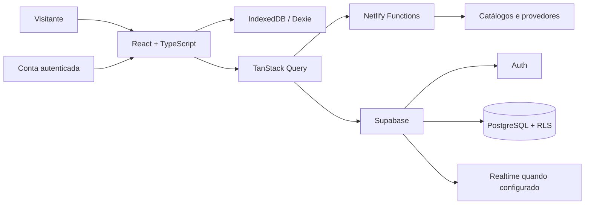

<div align="center">

# Hubora

### Uma central pessoal para descobrir, organizar e acompanhar o universo da cultura pop.

[English](README.en.md) · [Ver evidências técnicas](TEST_EVIDENCE.md) · [Matriz de provedores](PROVIDER_MATRIX.md)

[](https://hubora.netlify.app/)
[](https://github.com/Mayconxzdev/Hubora)
[](https://github.com/Mayconxzdev/Hubora/actions/workflows/ci.yml)


**Demonstração pública:** [hubora.netlify.app](https://hubora.netlify.app/)

</div>


## Visão geral

**Hubora** é uma aplicação web full-stack, responsiva e *local-first* para descobrir, organizar e acompanhar **filmes, séries, doramas, animes, mangás, quadrinhos, livros, novels e jogos**.

O produto resolve uma dor real: histórico, progresso e listas de assistir, ler ou jogar ficam dispersos em vários serviços. No Hubora, a jornada é contínua — encontrar uma obra, entender metadados e fontes, salvá-la na biblioteca e acompanhar o progresso sem perder o contexto.

| | |
|---|---|
| **Tipo** | Aplicação web responsiva e PWA instalável |
| **Contribuição** | Concepção de produto, UX/UI, arquitetura, desenvolvimento, integrações, persistência, autenticação e documentação |
| **Modos de uso** | Visitante com dados locais; conta autenticada quando a configuração remota está disponível |
| **Princípio de conteúdo** | Metadados, disponibilidade e reprodução são apresentados com limites explícitos; não há player ou fonte inventada |
| **Evidência de qualidade** | CI em `main` com checagens estáticas, lint, tipos, testes, build, regressão e auditorias visuais/a11y |

## Avaliação em dois minutos

1. Abra a [demonstração pública](https://hubora.netlify.app/) sem criar uma conta.
2. Navegue pelas nove categorias e use a busca global.
3. Abra uma obra, observe metadados, vídeos oficiais e fontes verificáveis.
4. Adicione itens à biblioteca e altere o status ou progresso.
5. Experimente filtros, ordenação e os modos de grade e lista.

**Atalhos:** [Início](https://hubora.netlify.app/) · [Filmes](https://hubora.netlify.app/movies) · [Jogos](https://hubora.netlify.app/games) · [Lançamentos](https://hubora.netlify.app/releases) · [Biblioteca](https://hubora.netlify.app/library)

> **Nota de transparência:** a URL pública exibe o último deploy de produção bem-sucedido. No momento, um novo deploy automático do `main` depende da regularização da cota da conta Netlify; por isso, código, [CI](https://github.com/Mayconxzdev/Hubora/actions) e documentação deste repositório são a referência da revisão atual.

## Fluxos do produto

### 1. Entender uma obra antes de decidir

A tela de detalhes adapta metadados e ações ao domínio. A pessoa pode consultar fontes, marcar como concluído, adicionar à biblioteca e navegar por vídeos, atividade e informações complementares.


### 2. Exibir apenas conteúdo verificável

Trailers e vídeos oficiais aparecem somente quando a origem permite incorporação. Sem fonte autorizada confirmada, a interface informa o limite em vez de simular disponibilidade.


### 3. Criar uma biblioteca pessoal entre formatos

A biblioteca reúne mídias diferentes em um só espaço, com busca, ordenação, filtros e visualizações em grade ou lista.


### 4. Manter consistência nos diferentes domínios

<table>
<tr>
<td width="50%" valign="top">

**Jogos como domínio de primeira classe**

O catálogo de jogos conserva a linguagem visual do produto, mas entrega informações e ações específicas do domínio.


</td>
<td width="50%" valign="top">

**Acompanhamento de lançamentos**

O produto organiza próximos lançamentos e descoberta orientada ao tempo, indo além de um catálogo estático.


</td>
</tr>
</table>

<details>
<summary><strong>Ver mais evidências de interface</strong></summary>

### Biblioteca em lista e filtros avançados


### Fontes de um jogo


</details>

> As capturas foram produzidas na aplicação em execução. Capas, títulos, trailers, metadados e marcas pertencem às respectivas fontes e são exibidos exclusivamente para demonstrar a experiência do produto.

## Entregas principais

- catálogo unificado para **nove domínios de mídia**;
- busca global, descoberta por categoria e páginas de detalhes orientadas ao domínio;
- biblioteca pessoal com status, avaliações, progresso, filtros e listas;
- diário, metas, lançamentos, Wrapped, conexões e insights;
- persistência local no dispositivo e PWA;
- autenticação por e-mail/senha e Google quando habilitada no Supabase;
- importação, exportação e backup local;
- funções serverless para integrações cuja credencial não pode ir para o navegador;
- tratamento honesto de loading, ausência, erro e indisponibilidade de provedores.

## Decisões de produto e engenharia

| Desafio | Decisão | Valor entregue |
|---|---|---|
| Unificar mídias com estruturas diferentes | Identidade canônica compartilhada e campos/ações específicos por domínio | UX consistente sem tratar livro, jogo, filme e série como o mesmo objeto |
| Permitir experimentação sem cadastro | Arquitetura **local-first** com IndexedDB/Dexie | Menor atrito inicial e dados úteis no próprio dispositivo |
| Separar dados pessoais por conta | Integração versionada com Supabase Auth, PostgreSQL e políticas RLS | Base preparada para isolamento; a revalidação remota independente de duas contas permanece documentada como pendente |
| Proteger credenciais e integrações | Segredos processados em Netlify Functions, fora do bundle do navegador | Fronteira cliente/servidor clara e menor exposição |
| Manter catálogos extensos responsivos | Cache persistente, carregamento progressivo, virtualização e imagens sob demanda | Navegação mais fluida e menos trabalho desnecessário no navegador |
| Integrar fontes comerciais com responsabilidade | Separação explícita entre metadados, prévias, conteúdo incorporável e links externos | Comunicação honesta sobre o que de fato está disponível |

## Arquitetura


```mermaid
flowchart LR
    GUEST[Visitante] --> APP[React + TypeScript]
    USER[Conta autenticada] --> APP
    APP --> LOCAL[IndexedDB / Dexie]
    APP --> QUERY[TanStack Query]
    QUERY --> FUNCTIONS[Netlify Functions]
    QUERY --> SUPABASE[Supabase]
    FUNCTIONS --> PROVIDERS[Catálogos e provedores]
    SUPABASE --> AUTH[Auth]
    SUPABASE --> DB[(PostgreSQL + RLS)]
    SUPABASE --> REALTIME[Realtime quando configurado]
```

## Stack técnico

| Área | Tecnologias |
|---|---|
| **Interface** | React 19, TypeScript, Vite, Tailwind CSS, Radix UI, Motion |
| **Estado e dados assíncronos** | Zustand, TanStack Query |
| **Persistência local** | IndexedDB, Dexie, idb-keyval |
| **Backend serverless** | Netlify Functions, Express |
| **Autenticação e nuvem** | Supabase Auth, PostgreSQL, Realtime e políticas de Row Level Security |
| **Validação** | Zod, ESLint, TypeScript |
| **Testes e acessibilidade** | Vitest, Testing Library, Playwright, axe-core |
| **Entrega** | PWA, Netlify e scripts de verificação de release |

## Competências demonstradas

- arquitetura de aplicações React e TypeScript;
- modelagem de produto e dados para vários domínios;
- estado de cliente, cache assíncrono e persistência offline;
- integração de APIs e Functions sem expor segredos;
- UI responsiva, acessível e orientada a estados reais;
- testes unitários, E2E, regressão e auditorias de acessibilidade;
- documentação técnica de provedores, variáveis, deploy, rollback e limites do produto.

## Qualidade e execução local

```bash
# contratos estáticos de segurança e release
npm run verify:static

# lint, tipos, testes unitários e build de produção
npm run check

# verificação completa, incluindo E2E
npm run verify:release
```

**Requisitos:** Node.js `>= 22.12.0` e npm compatível com o `package-lock.json` versionado.

```bash
git clone https://github.com/Mayconxzdev/Hubora.git
cd Hubora
npm ci --no-audit --no-fund
Copy-Item .env.example .env # PowerShell
npm run dev
```

## Documentação e evidências

- [Contrato de produto](PRODUCT.md)
- [Direção de design](DESIGN.md)
- [Matriz de provedores](PROVIDER_MATRIX.md)
- [Variáveis de ambiente](ENVIRONMENT_VARIABLES.md)
- [Evidências de teste](TEST_EVIDENCE.md)
- [Readiness de release](RELEASE_READINESS_REPORT.md)
- [Deploy e rollback](DEPLOY_AND_ROLLBACK.md)
- [Política de segurança](SECURITY.md)

## Escopo e limites atuais

Hubora demonstra uma aplicação completa e executável, mas não mascara dependências externas como se fossem funcionalidades garantidas:

- provedores dependem de credenciais válidas, disponibilidade da API, região e permissão de incorporação;
- fontes comerciais não recebem player interno sem autorização comprovada;
- conexões com servidores pessoais (Jellyfin, Plex, Emby, Komga, Kavita e OPDS) exigem configuração do proprietário;
- autenticação, sincronização e Realtime exigem ambiente Supabase corretamente configurado; a evidência recente de isolamento remoto com duas contas ainda deve ser renovada antes de uma declaração de produção plena;
- a produção no Netlify aguarda a regularização de cota indicada acima para publicar o `main` atual.

## Autor

**Maycon Ferreira**

Projeto construído para demonstrar produto digital, engenharia web, automação, integração de APIs, persistência local, autenticação, segurança e qualidade de software.

[GitHub](https://github.com/Mayconxzdev) · [Demonstração pública](https://hubora.netlify.app/)

## Licença

O código é distribuído sob [GNU AGPL-3.0-or-later](LICENSE). Obras de arte, capas, metadados e serviços externos permanecem sujeitos aos respectivos direitos, licenças e termos.
