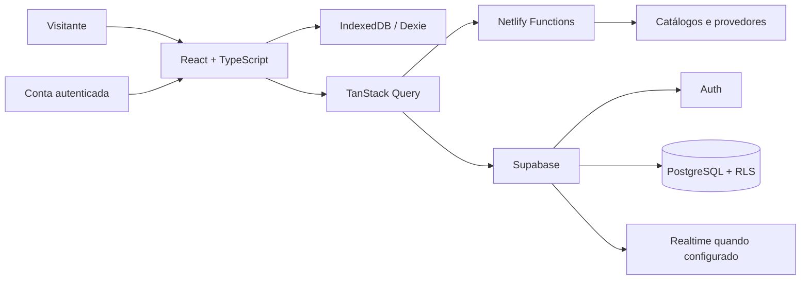

<div align="center">

# Hubora

### Uma central pessoal para descobrir, organizar e acompanhar o universo da cultura pop.

[English](README.en.md) · [Testes](TEST_EVIDENCE.md) · [Provedores](PROVIDER_MATRIX.md)

[](https://hubora.netlify.app/)
[](https://github.com/Mayconxzdev/Hubora)
[](https://github.com/Mayconxzdev/Hubora/actions/workflows/ci.yml)


**Demonstração pública:** [hubora.netlify.app](https://hubora.netlify.app/)

</div>


## Visão geral

Criei o **Hubora** para reunir em um só lugar filmes, séries, doramas, animes, mangás, quadrinhos, livros, novels e jogos. A ideia surgiu porque histórico, progresso e listas de assistir, ler ou jogar costumam ficar espalhados em vários serviços.

A aplicação permite descobrir uma obra, consultar metadados e fontes, salvá-la na biblioteca e acompanhar o progresso. O projeto também foi meu trabalho final no curso **Ferramentas de IA: Agentes e Automações**, de 40 horas, concluído no SENAI Casa Firjan.

| Aspecto | Situação atual |
|---|---|
| **Tipo** | Aplicação web responsiva e PWA instalável |
| **Minha atuação** | Produto, UX/UI, arquitetura, desenvolvimento, integrações, persistência, autenticação e documentação |
| **Uso sem cadastro** | Visitante com dados locais no próprio dispositivo |
| **Conta autenticada** | Supabase quando o ambiente remoto está configurado |
| **Conteúdo externo** | Metadados, disponibilidade e reprodução aparecem com limites explícitos; não há player ou fonte inventada |
| **Versão** | v1.0.0 publicada para demonstração; integrações externas e validação multiusuário são acompanhadas separadamente |

## Qualidade atual

A branch `main` passa por lint sem avisos, typecheck, 138 testes unitários, build/PWA, regressão E2E desktop e verificações visuais e de acessibilidade em desktop, tablet e Android.

Os comandos e relatórios ficam em [TEST_EVIDENCE.md](TEST_EVIDENCE.md) e [RELEASE_READINESS_REPORT.md](RELEASE_READINESS_REPORT.md).

## Como experimentar

1. Abra a [demonstração pública](https://hubora.netlify.app/) sem criar uma conta.
2. Navegue pelas nove categorias e use a busca global.
3. Abra uma obra para consultar metadados, vídeos oficiais e fontes disponíveis.
4. Adicione itens à biblioteca e altere status ou progresso.
5. Experimente filtros, ordenação e os modos de grade e lista.

**Atalhos:** [Início](https://hubora.netlify.app/) · [Filmes](https://hubora.netlify.app/movies) · [Jogos](https://hubora.netlify.app/games) · [Lançamentos](https://hubora.netlify.app/releases) · [Biblioteca](https://hubora.netlify.app/library)

## Principais fluxos

### Entender uma obra antes de decidir

A tela de detalhes adapta metadados e ações ao tipo de mídia. A pessoa pode consultar fontes, marcar como concluído, adicionar à biblioteca e acessar vídeos e informações complementares.


### Mostrar apenas conteúdo verificável

Trailers e vídeos aparecem somente quando a origem permite incorporação. Sem uma fonte autorizada confirmada, a interface informa a limitação em vez de simular disponibilidade.


### Manter uma biblioteca entre formatos

A biblioteca reúne mídias diferentes com busca, ordenação, filtros e visualizações em grade ou lista.


### Preservar as diferenças de cada domínio

| Jogos | Lançamentos |
|---|---|
| O catálogo mantém a identidade visual do produto, mas usa informações e ações específicas para jogos. | A aplicação organiza próximos lançamentos e descoberta orientada ao tempo. |
|  |  |

<details>
<summary><strong>Ver mais telas</strong></summary>

### Biblioteca em lista e filtros avançados


### Fontes de um jogo


</details>

> As capturas foram feitas na aplicação em execução. Capas, títulos, trailers, metadados e marcas pertencem às respectivas fontes.

## O que desenvolvi

- catálogo unificado para **nove domínios de mídia**;
- busca global, descoberta por categoria e páginas de detalhes orientadas ao domínio;
- biblioteca pessoal com status, avaliações, progresso, filtros e listas;
- diário, metas, lançamentos, Wrapped, conexões e insights;
- persistência local no dispositivo e PWA;
- autenticação por e-mail/senha e Google quando habilitada no Supabase;
- importação, exportação e backup local;
- funções serverless para integrações cujas credenciais não podem ir para o navegador;
- tratamento de loading, ausência, erro e indisponibilidade de provedores.

## Decisões de produto e engenharia

| Desafio | Decisão | Resultado |
|---|---|---|
| Unificar mídias com estruturas diferentes | Identidade canônica compartilhada e campos específicos por domínio | Experiência consistente sem tratar livro, jogo, filme e série como o mesmo objeto |
| Permitir uso sem cadastro | Arquitetura local-first com IndexedDB/Dexie | Menor atrito inicial e dados úteis no próprio dispositivo |
| Separar dados pessoais por conta | Supabase Auth, PostgreSQL e políticas RLS | Base para isolamento entre contas; nova verificação remota independente continua pendente antes de uma declaração plena de produção |
| Proteger credenciais | Netlify Functions fora do bundle do navegador | Fronteira cliente/servidor mais clara |
| Manter catálogos extensos responsivos | Cache persistente, carregamento progressivo, virtualização e imagens sob demanda | Menos trabalho desnecessário no navegador |
| Integrar fontes comerciais com responsabilidade | Separação entre metadados, prévias, conteúdo incorporável e links externos | A interface mostra somente o que a origem realmente permite |

## Arquitetura


```mermaid
flowchart LR
    GUEST[Visitante] --> APP[React + TypeScript]
    USER[Conta autenticada] --> APP
    APP --> LOCAL[IndexedDB / Dexie]
    APP --> QUERY[TanStack Query]
    QUERY --> FUNCTIONS[Netlify Functions]
    QUERY --> SUPABASE[Supabase]
    FUNCTIONS --> PROVIDERS[Catálogos e provedores]
    SUPABASE --> AUTH[Auth]
    SUPABASE --> DB[(PostgreSQL + RLS)]
    SUPABASE --> REALTIME[Realtime quando configurado]
```

## Stack

| Área | Tecnologias |
|---|---|
| Interface | React 19, TypeScript, Vite, Tailwind CSS, Radix UI, Motion |
| Estado e dados assíncronos | Zustand, TanStack Query |
| Persistência local | IndexedDB, Dexie, idb-keyval |
| Backend serverless | Netlify Functions, Express |
| Autenticação e nuvem | Supabase Auth, PostgreSQL, Realtime e Row Level Security |
| Validação | Zod, ESLint, TypeScript |
| Testes e acessibilidade | Vitest, Testing Library, Playwright, axe-core |
| Entrega | PWA, Netlify e scripts de verificação de release |

## Executar localmente

```bash
npm run verify:static
npm run check
npm run verify:release
```

**Requisitos:** Node.js `>= 22.12.0` e npm compatível com o `package-lock.json` versionado.

```powershell
git clone https://github.com/Mayconxzdev/Hubora.git
cd Hubora
npm ci --no-audit --no-fund
Copy-Item .env.example .env
npm run dev
```

## Documentação

- [Contrato de produto](PRODUCT.md)
- [Direção de design](DESIGN.md)
- [Matriz de provedores](PROVIDER_MATRIX.md)
- [Variáveis de ambiente](ENVIRONMENT_VARIABLES.md)
- [Testes](TEST_EVIDENCE.md)
- [Estado da release](RELEASE_READINESS_REPORT.md)
- [Deploy e rollback](DEPLOY_AND_ROLLBACK.md)
- [Política de segurança](SECURITY.md)

## Estado e limites

- provedores dependem de credenciais válidas, disponibilidade da API, região e permissão de incorporação;
- fontes comerciais não recebem player interno sem autorização confirmada;
- conexões com Jellyfin, Plex, Emby, Komga, Kavita e OPDS exigem configuração do proprietário;
- autenticação, sincronização e Realtime exigem Supabase corretamente configurado;
- a demonstração pública mostra o último deploy de produção bem-sucedido; o código da branch `main` é a referência mais atual enquanto a cota da conta Netlify não permite um novo deploy;
- Google Books permanece com falha externa do provedor e é tratado com um estado explícito de indisponibilidade.

## Autor

**Maycon Ferreira**

[GitHub](https://github.com/Mayconxzdev) · [Demonstração pública](https://hubora.netlify.app/)

## Licença

O código é distribuído sob [GNU AGPL-3.0-or-later](LICENSE). Obras de arte, capas, metadados e serviços externos permanecem sujeitos aos respectivos direitos, licenças e termos.
