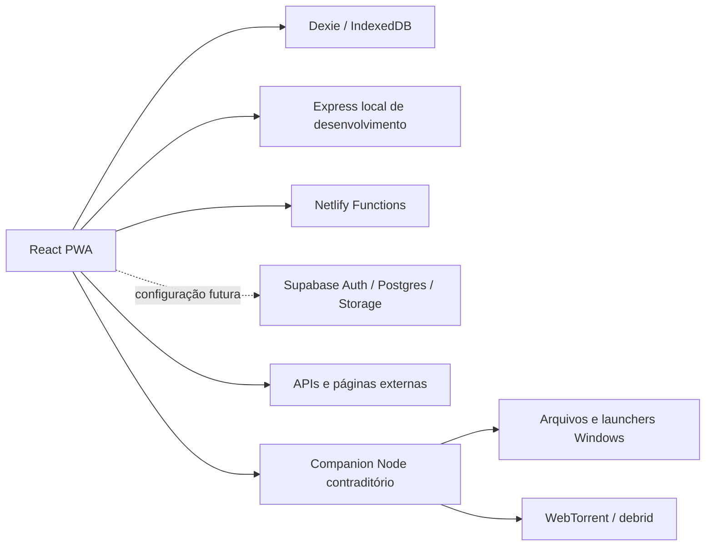
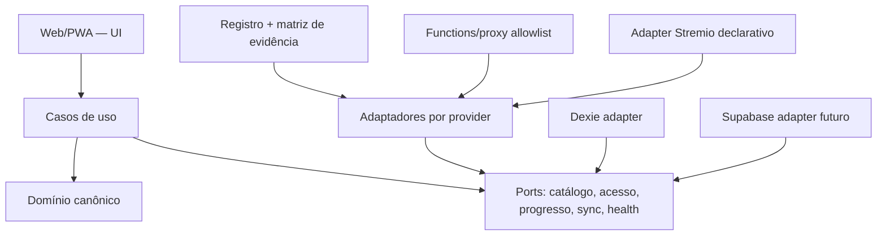

# Hubora 9.0.0 — arquitetura inicial e direção de migração

## Topologia observada

## Características do código atual

- `src/App.tsx` centraliza lazy imports, rotas, autenticação e layout.
- `src/services/api.ts` concentra múltiplos domínios e providers em 1.731 linhas.
- `src/index.css` concentra 2.916 linhas de estilo global.
- Zustand e Dexie formam o núcleo local-first; Supabase é opcional no runtime atual.
- O diretório de providers é declarativo, mas atribui capacidades sem evidência operacional acoplada.
- O protocolo de providers mistura Hubora/Stremio, fetch do navegador, adaptação e resolução de acesso.
- O Companion mistura pareamento, persistência de token, proxy/cache, HLS, torrent, debrid, mídia local e shell.

## Arquitetura-alvo incremental

React, TypeScript e Vite serão preservados. A separação por domínio começa dentro do repositório atual; não será criado um monorepo cosmético antes de existirem fronteiras reais.

## Domínios

- identidade e autorização privada;
- catálogo/identidade canônica;
- biblioteca e estados pessoais;
- progresso e continuidade;
- descoberta/recomendação;
- providers, instalação, capacidades e saúde;
- acesso e player;
- documentos, capítulos e leitores;
- sync, backup e conflitos;
- Cofre transversal;
- jogos manuais.

## Entidades mínimas

- `MediaIdentity`, `ExternalIdentity`, `MediaWork`, `Edition`, `Season`, `Episode`, `Volume`, `Chapter`;
- `Person`, `Organization`, `FranchiseRelation`;
- `LibraryEntry`, `Progress`, `PersonalStatus`, `Note`, `Tag`;
- `Provider`, `ProviderInstallation`, `ProviderCapability`, `ProviderHealth`, `AccessOption`;
- `UserAccount`, `Membership`, `DeviceSession`, `SyncRevision`, `BackupManifest`.

## Contratos arquiteturais

- UI não acessa provider diretamente.
- Provider não altera store global.
- IDs externos são mapeados para identidade canônica antes de deduplicar.
- Capacidades são declaradas e confirmadas por contract/evidence tests.
- Manifests instaláveis são HTTP/JSON; não executam JavaScript arbitrário.
- Fetch remoto passa por allowlist, validação de protocolo/host/IP/redirect e limites.
- Segredos nunca entram na biblioteca sincronizada nem no bundle público.
- `infoHash`, magnet e `notWebReady` não viram URL web falsa.
- Falha de um provider não derruba busca/detalhes globais.

## Decisões já tomadas

1. Web/PWA é a única superfície de produto desta fase.
2. Companion será removido, não reescrito.
3. Stremio Service é integração opcional do usuário; deep link é fallback.
4. Jogos são manuais e não executam programas locais.
5. Novels é domínio de primeira classe.
6. Cofre é contexto transversal.
7. Supabase/Netlify remotos só serão configurados após autorização.
8. Migração será estranguladora e coberta por testes; nenhum “big bang”/monorepo antecipado.

## ADRs necessários

- remoção do Companion e política para dados legados;
- protocolo Hubora v1 e adapter Stremio;
- identidade canônica/deduplicação;
- segurança de egress/SSRF;
- sync, revisão, conflito e backup;
- autenticação privada e modelo de convites;
- PWA/cache/offline por classe de recurso.
