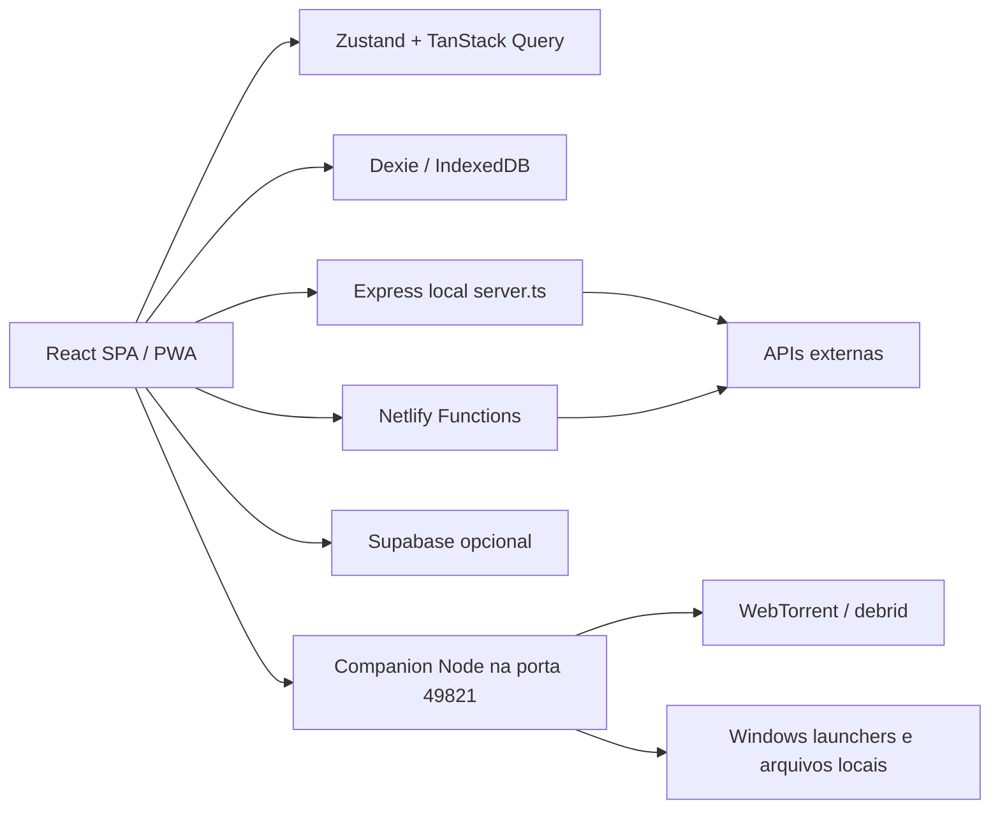
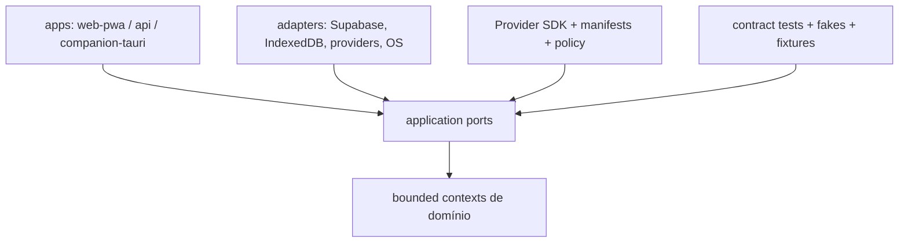

# Arquitetura inicial observada

## Diagrama atual

## Características

- Organização predominantemente por camada técnica (`pages`, `services`, `components`, `lib`, `store`).
- Contratos de domínio e transporte compartilham `src/types/index.ts`.
- A lógica de provedores aparece em catálogo estático, protocolo, serviços específicos e páginas.
- Há persistência local real, sincronização opcional e recursos remotos, mas as fronteiras não são isoladas em ports/adapters.
- Express e Netlify Functions constituem dois hosts backend com capacidades parcialmente sobrepostas.
- O Companion é uma aplicação separada apenas operacionalmente; não há workspace/monorepo formal.

## Acoplamentos relevantes

1. Componentes/páginas chamam serviços concretos e o Dexie diretamente ou por repositórios finos.
2. Tipos canônicos, DTOs de provedores e configurações de infraestrutura convivem no mesmo arquivo.
3. O protocolo converte categorias externas para `MediaType`; antes da primeira fatia, tipos desconhecidos tinham fallback silencioso para filme.
4. Credenciais de integrações são tratadas no browser; a garantia de armazenamento depende do serviço local de segredo e do IndexedDB.
5. O Companion combina pareamento, rede, fetch remoto, cache, torrent/debrid e execução no Windows em um único processo.

## Direção proposta, ainda não aplicada

Bounded contexts candidatos:

- Identity & Access.
- Catalog & Canonical Identity.
- Personal Library & Progress.
- Discovery & Recommendations.
- Providers & Availability.
- Reader & Player.
- Companion & Device Pairing.
- Sync, Backup & Conflict Resolution.
- Notifications & Releases.

Essa direção requer ADRs e validação humana antes de substituir a arquitetura central. A estratégia recomendada é estrangulamento incremental: definir contratos, mover uma fatia vertical por vez e manter adaptadores para o comportamento existente enquanto houver dados compatíveis.
